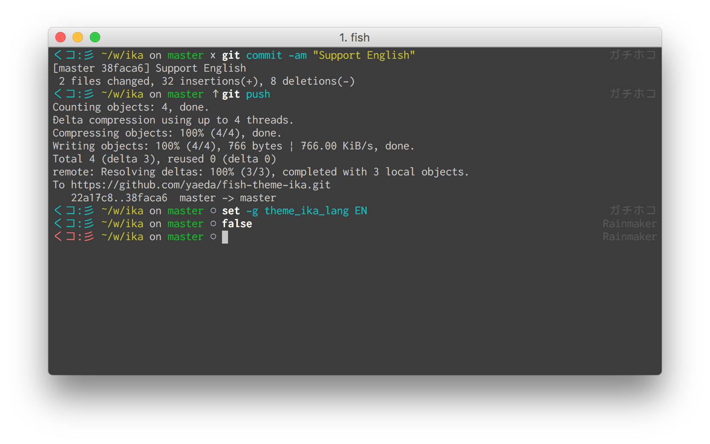

# fish-theme-ika
A くコ:彡 theme for fish shell.
Based on [theme-default](https://github.com/oh-my-fish/theme-default) by Bruno Pinto

## Install

```fish
$ fisher yaeda/fish-theme-ika
```

## Features

* Current rule of ranked battle hanging out off to the right. (in Japanese)
* (All the things you need to know about Git in a glance.)
* (Previous command status.)

## Screenshot

<p align="center">
  
</p>

## Configuration

Change language of rule:
```fish
  set -g theme_ika_lang 'EN' # 'JP' or 'EN'
```

Only display the folder name:
```fish
  set -g theme_short_path yes
```

# License

[MIT][mit] © [yaeda][author]


[mit]:            http://opensource.org/licenses/MIT
[author]:         http://github.com/yaeda
